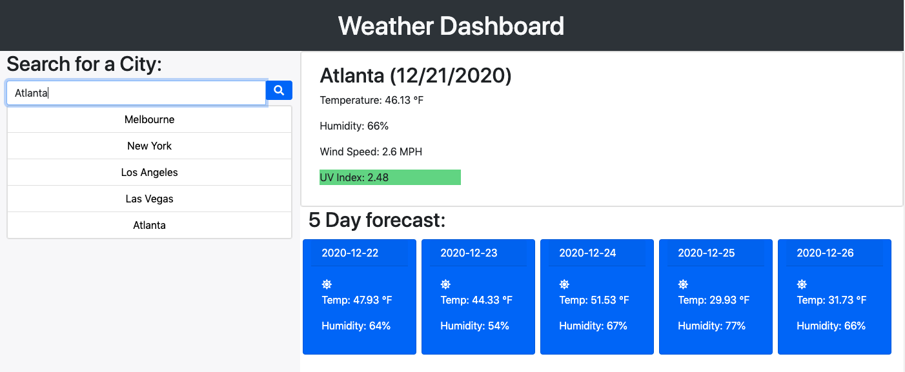

# weather-dashboard

## Description
A dashboard for weather queries using server-side APIs

## Installation
- [Clone this repo](https://github.com/brhestir/weather-dashboard.git)
- Push to GitHub
- Serve main branch via GitHub Pages.

## Usage
View the site at [weather-dashboard](https://brhestir.github.io/weather-dashboard/)

## Credits
- gt-atl-fsf-ft-11-2020-u-c
- [OpenWeather API](https://openweathermap.org/api)

## Licence
MIT